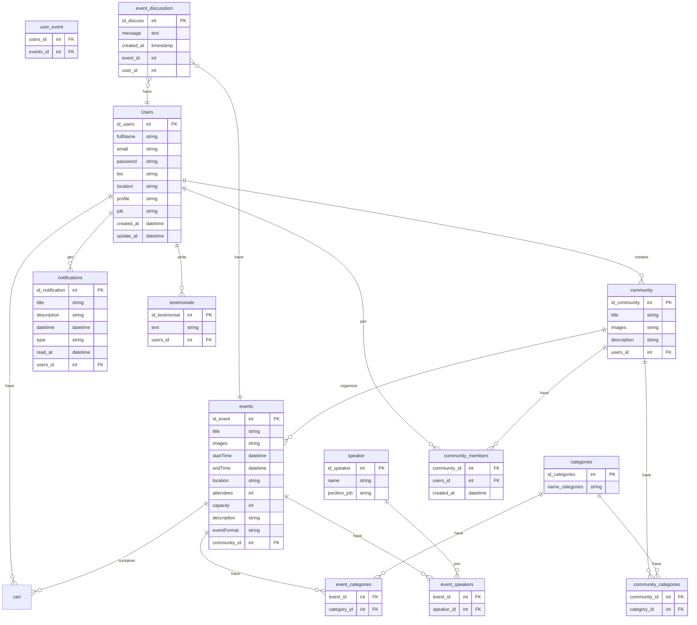
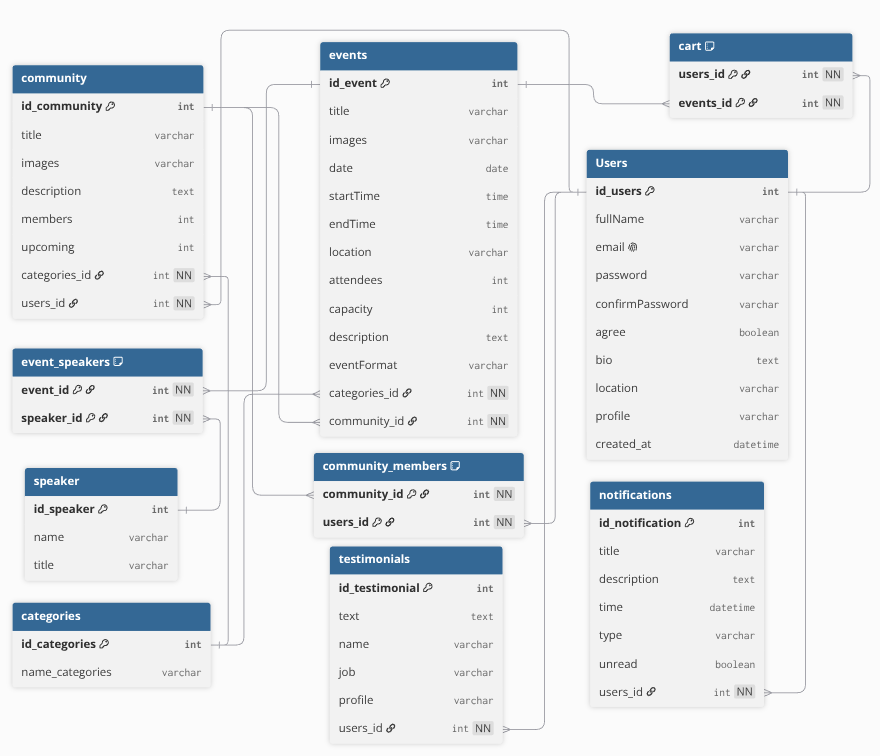

```mermaid
erDiagram
    Users {
        id_users int PK
        fullName string
        email string
        password string
        bio string
        location string
        profile string
        job string
        created_at datetime
        update_at datetime
    }

    user_event {
        users_id int FK
        events_id int FK
    }

    speaker {
        id_speaker int PK
        name string
        pocition_job string
    }

    categories {
        id_categories int PK
        name_categories string
    }

    events {
        id_event int PK
        title string
        images string
        startTime datetime
        endTime datetime
        location string
        attendees int
        capacity int
        description string
        eventFormat string
        community_id int FK
    }

    event_categories {
        event_id int FK
        category_id int FK
    }

    event_speakers {
        event_id int FK
        speaker_id int FK
    }

    community {
        id_community int PK
        title string
        images string
        description string
        users_id int FK
    }

    community_categories {
        community_id int FK
        category_id int FK
    }

    community_members {
        community_id int FK
        users_id int FK
        created_at datetime
    }

    notifications {
        id_notification int PK
        title string
        description string
        datetime datetime
        type string
        read_at datetime
        users_id int FK
    }

    testimonials {
        id_testimonial int PK
        text string
        users_id int FK
    }

    event_discusstion {
        id_discuss int PK
        message text
        created_at timestamp
        event_id int 
        user_id int
    }

    event_discusstion }o--|| events : have
    event_discusstion }o--|| Users : have
    Users ||--o{ cart : have
    events ||--o{ cart : container
    events ||--o{ event_categories : have
    categories ||--o{ event_categories : have
    community ||--o{ events : organizer
    events ||--o{ event_speakers : have
    speaker ||--o{ event_speakers : join
    community ||--o{ community_categories : have
    categories ||--o{ community_categories : have
    Users ||--o{ community : createe
    Users ||--o{ community_members : join
    community ||--o{ community_members : have
    Users ||--o{ notifications : get
    Users ||--o{ testimonials : write
```

